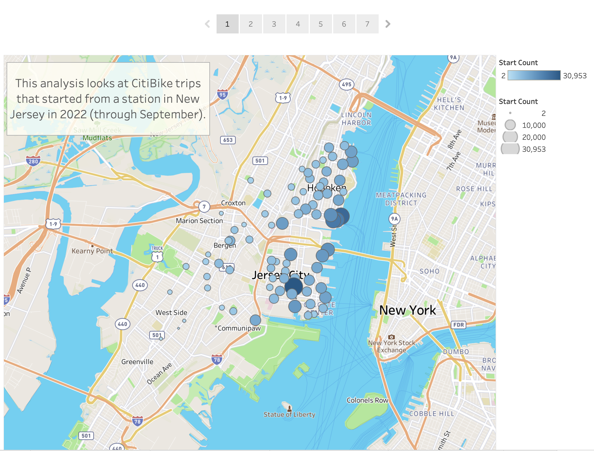
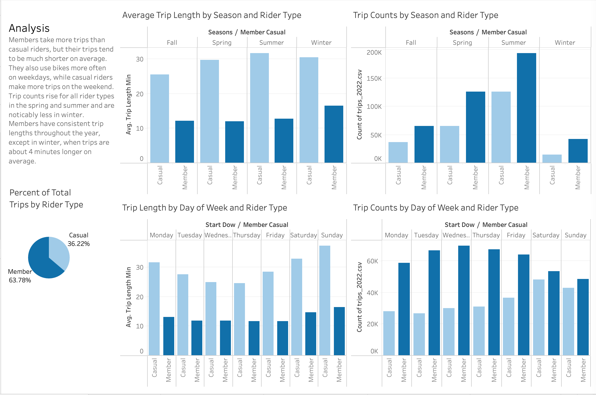
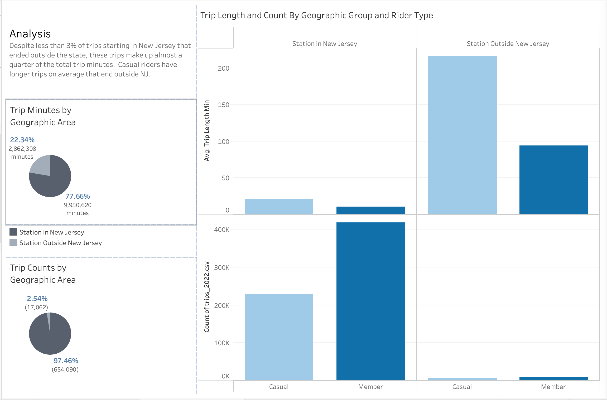
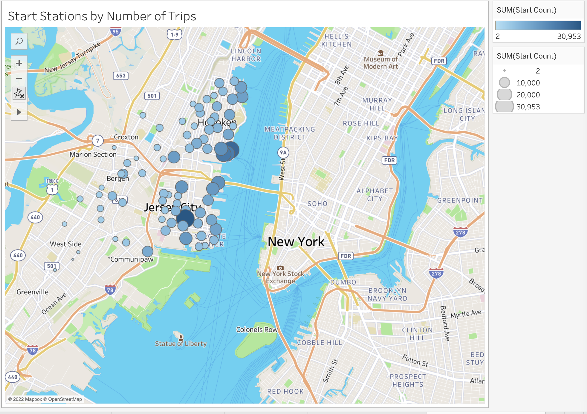
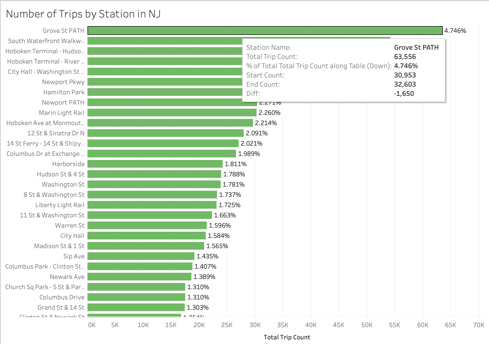
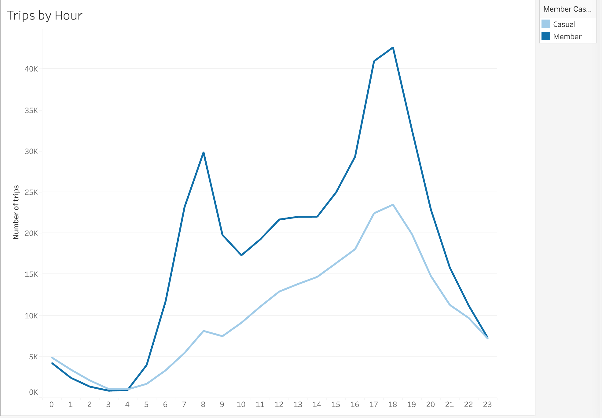
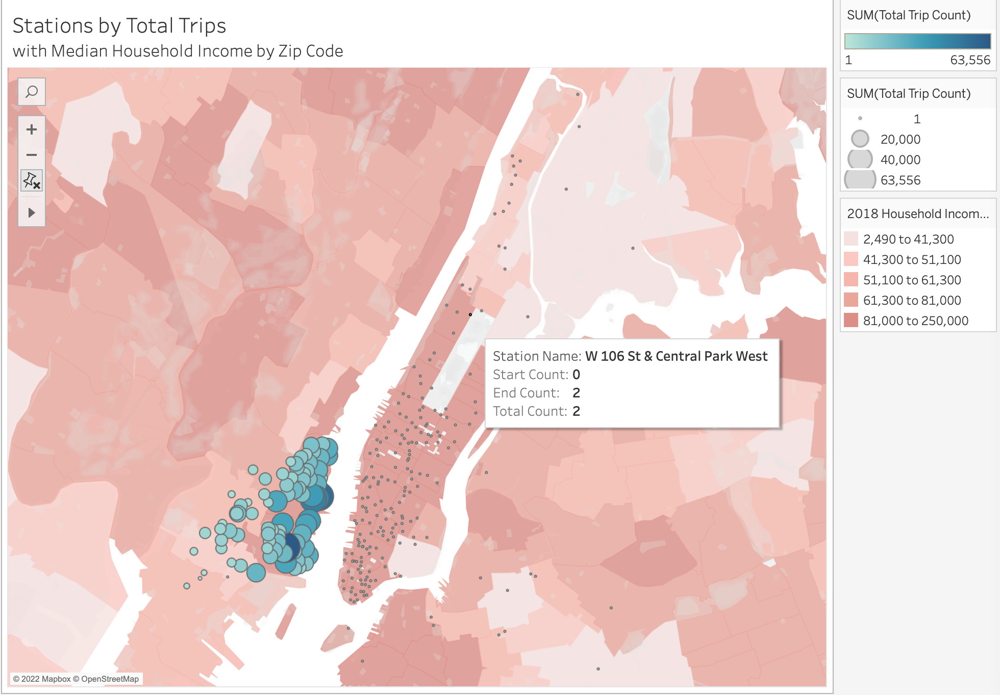

# CitiBike Analysis
This goal of this project is to analyze the data found in the [Citi Bike Trip History Logs](https://ride.citibikenyc.com/system-data), find two unexpected phenomena, visualize these phenomena, and present them in a clear and logical story in Tableau.

## Process

I chose to limit my data to the datasets for trips starting in New Jersey and for the data from 2022 to day (through September). This gave me enough data to find interesting patterns without being too unweildy. 

I used Python to loop through all the files downloaded and created a single dataframe containing all the trip data. I calculated the length of each trip in minutes and removed any trips less than a minute. I also added columns for day of week and month to make analysis in Tableau easier. I also created a dataframe with a row for each unique station, the start and end trip counts as well as total counts and the coordinates of the station. I exported both dataframes to csv files to use in Tableau.

All the data cleaning and exploration code can be found in the [data_cleaning_exploration](data_cleaning_exploration.ipynb)  Jupyter Notebook. Source data can be found in the `data/source` directory, while process data files are in `data`.

## Tableau
The Tableau visualizations, dashboard, maps, and story can be found on [Tableau Public](https://public.tableau.com/views/CitiBikeAnalysis_16667286992680/FinalPresentation?:language=en-US&publish=yes&:display_count=n&:origin=viz_share_link).

## Analysis

### Phenomenon 1: Difference in use patterns between casual riders and those with memberships

Riders with memberships take more trips of shorter lengths than those without. These trips occur more frequently during weekdays and at typical commute times, suggesting members may use CitiBikes for all or part of their commute.

Trip counts rise for all rider types in the spring and summer and are noticably less in winter. Members have consistent trip lengths throughout the year, except in winter, when trips are about 4 minutes longer on average.

### Phenomenon 2: Patterns of trips ending outside NJ

Less than 3% of trips end outside New Jersey but those trips make up almost 25% of trip time. Casual riders take noticably longer trips (averaging 3.6 hours) that end outside New Jersey. 

### Other Visualizations

